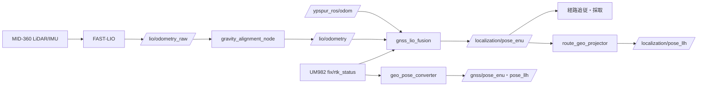

# システム構成

## 読む順序

[ワークスペースREADME](../README.md)で依存とビルドを確認し、
[共通起動](../src/icart_bringup/README.md)から実機・模擬環境を選ぶ。
実機の接続・取付・Joy操作は[実機ハードウェア統合](../src/icart_bringup/docs/実機ハードウェア統合.md)、
画面操作は[robot_console](../src/robot_console/README.md)を参照する。
本書は共通起動で使用する構成を説明する。個別診断launchとは配信元・設定が異なる場合がある。

## パッケージの責務

| 領域 | パッケージ | 役割 |
| --- | --- | --- |
| 共通起動 | icart_bringup | セッション生成、設定検査、実機／模擬の起動 |
| センサ | rtk_gps_um982、livox_ros_driver2、urg_node、usb_cam | GNSS、LiDAR/IMU、2D scan、カメラ入力 |
| 局所位置推定 | FAST_LIO | LiDARとIMUから相対姿勢・点群地図を生成 |
| 融合 | gnss_lio_fusion | 重力整列、GNSS品質判定、LIO／車輪相対運動との融合、自律減速 |
| 座標変換 | geo_pose_converter、tc_geo_msgs | LLH・ENU・方位の変換と表示用データ |
| 経路 | route_planner、route_manager、route_follower、tc_route_msgs | 経路生成・配信・進捗・停止属性・回避目標 |
| 速度 | robot_navigator、drive_mode_manager、ypspur_ros2 | 目標追従、手動／自律切替、車輪制御・制限監視 |
| 障害物・認識 | obstacle_monitor、yolo_detector、road_blockage_detector、traffic_signal_recognizer | scan監視、画像検出、通行止め・信号判定 |
| 採取 | route_survey | 手動走行の融合軌跡、回避幅候補、経路編集 |
| 操作・観測 | robot_console | PyQt5操作画面、読取専用HTML観測、bag記録 |
| 模擬 | obstacle_route_sim | Gazebo環境、模擬センサ・歩行者、評価ツール |

## 自己位置と地図



GNSS単独変換は比較・診断用で、融合ノードはNavSatFixとRtkStatusを直接読む。
共通構成の `/localization/pose_enu` 配信元は融合ノード一つにする。
FAST-LIOのIMU原点から車軸中心への補正と、主GNSSアンテナの位置補正を行う。

起動時に約2秒の静止から重力基準を確定し、良好FIX・方位を待つ。
GNSS低品質時はLIOを優先し、LIO異常時は有効な車輪相対運動へ退避する。
どちらも有効でなければ自律指令を停止する。相対運動だけでは長時間の絶対位置ずれを解消できない。

平面融合姿勢とFAST-LIOの3D地図は用途が異なる。
`/cloud_registered` はraw LIO世界座標、`/cloud_registered_body` はIMU/body座標である。
融合位置をFAST-LIOへ戻して地図を最適化する処理はない。
map→odom→base_linkの二層TFによる補正ジャンプ隔離も実装していない。
共通実機構成のmap→base_linkは平面TFである。

## 経路と速度指令

LLHの採取CSVと共通projectionからroute_plannerがENU経路を生成し、
route_managerが `/active_route` を配信する。
route_followerは現在位置と停止・信号・回避状態から `/active_target` を更新する。
managerは `/follower_state` を購読して進捗と完了を反映する。

```text
robot_navigator → /cmd_vel/autonomous → gnss_lio_fusion → /cmd_vel/fusion_limited
                                                                  ↓
Joy → manual_teleop → /cmd_vel/manual ───────────────────→ drive_cmd_mux
                                                                  ↓ /cmd_vel
ypspur_ros2 → YP-Spur coordinator → 車輪
```

navigatorは位置・odom・障害物入力とドライバのMotionLimitsを監視する。
ブレーキ距離は現在速度・線減速度・応答遅れから求める。
ドライバの能力確認・生存監視が成立しなければ実機自律指令を出さない。
手動指令はdeadmanで制御し、自律側の融合減速・障害物監視を通らない。

R1保持は融合に対するGNSS途絶模擬で、ターボ割当は無効。
採取構成は手動固定、自律構成はmanual_startで開始・停止点から再開する。
manual_start=falseは走行停止指令ではない。

## トピックと健全性監視

配信様式・公称レート・QoS・型付きメッセージの規則は[トピック通信規約](トピック通信規約.md)に従う。
`/fusion/status` は `tc_geo_msgs/FusionState` で融合モードと推定品質を通知する。
robot_consoleはトピックの受信鮮度と `/diagnostics` の自己申告から稼働・縮退を表示する。
判定条件と外部起動の扱いは[ノード健全性監視設計](ノード健全性監視設計.md)を参照する。

## 時刻・設定・運用

実機は外部NTP→PC chrony→software PTP→MID-360を使う。
GNSSはGGA測定時刻とRMC日付からUTCを付け、USB到着時刻でPC時計を合わせない。
共通実機起動は同期ゲートを待ち、条件喪失時はスタックを終了する。
[時刻同期](GNSS_FASTLIO時刻同期提案.md)と[共通起動設計](../src/icart_bringup/docs/共通起動設計.md)を参照する。

運用設定はsession.yamlと関連YAMLへ保存する。生成済みコピーはソース変更に追従しない。
実機domain 0、模擬domain 86を使い、切替前に全停止する。
単純な経路制御試験には真値poseの模擬構成もあるが、融合評価はFAST-LIO入力を使う。

## 採取幅と現行の制約

route_surveyは点群の連続観測・局所平面・粗さ・段差・反射強度から左右幅の候補を作る。
保存値は車体中心の横移動余裕であり、人・コーン等を取り除いた歩道の恒久的な全幅ではない。
局所空き空間を使うサンプルと閾値評価はオフラインツールで、実走の進路生成には接続していない。
現地の取付・同期・測位・停止距離・経路幅の確認は、模擬試験と分けて行う。
