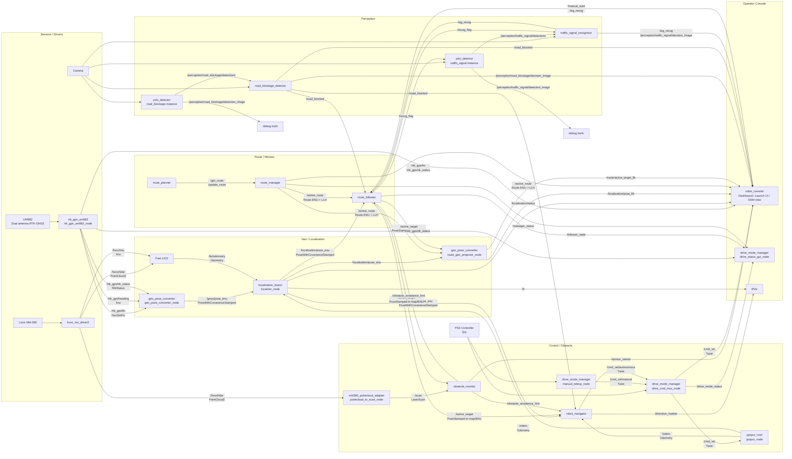
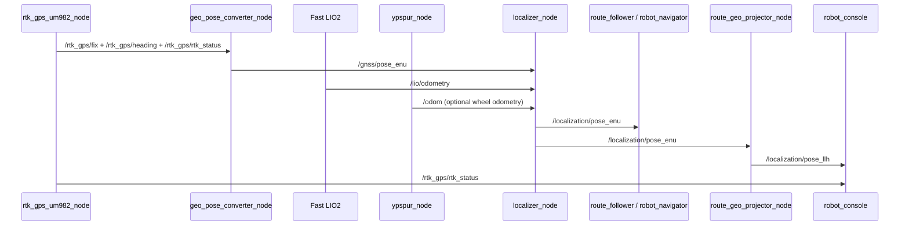
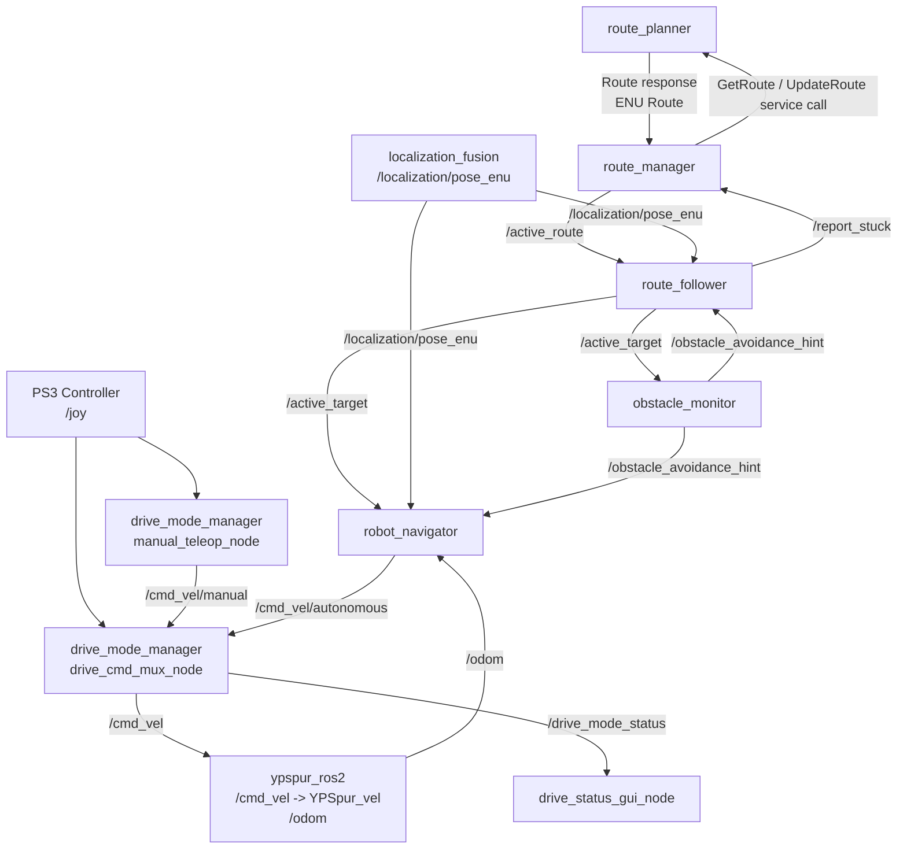
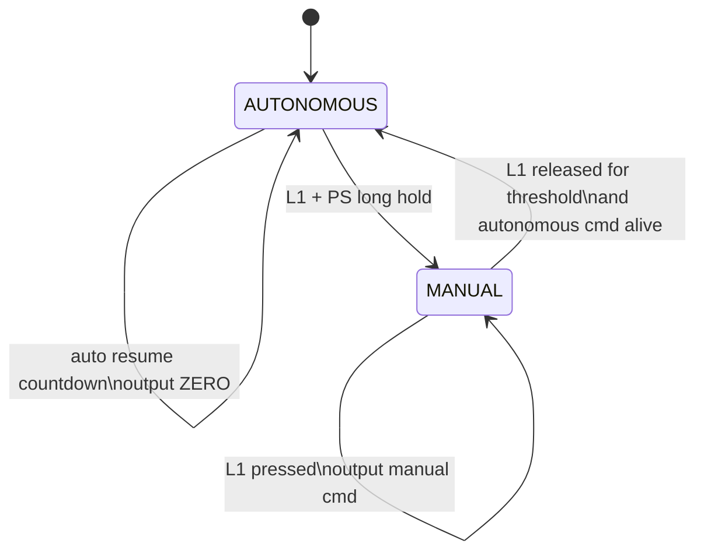
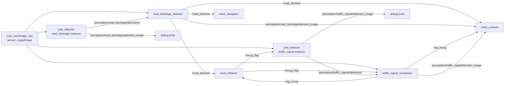
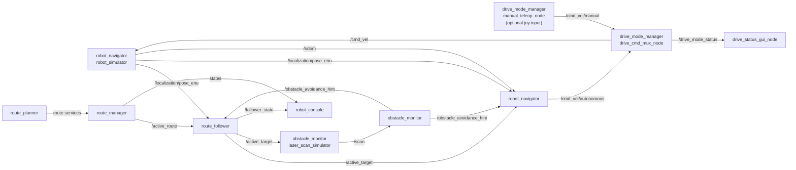
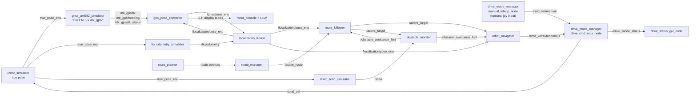

# 次期システム アーキテクチャ検討レポート

作成日: 2026-05-13

## 改版履歴

| 版 | 日付 | 変更概要 |
| --- | --- | --- |
| 1.0 | 2026-05-13 | 初版作成。現行パッケージ構成、`rtk_gps_um982`, `rtk_gps_um982_msgs`, `ypspur_ros2` を含む次期システム構成、今後追加するパッケージ、未決事項を整理した |
| 2.0 | 2026-05-13 | 認識系の責務分担を見直し、`yolo_detector`, `road_blockage_detector`, `traffic_signal_recognizer` の 3 パッケージ構成を次期方針として追加した |
| 3.0 | 2026-05-19 | 自律走行・手動走行切替の運用方針を反映し、`drive_mode_manager` による `/cmd_vel` 排他選択、専用状態 GUI、自律復帰カウントダウンを追加した |
| 3.1 | 2026-05-28 | route正本は `/active_route` にENU poseとLLH poseを併せ持たせ、LLH route別topicを原則不要とする方針へ更新した |
| 3.4 | 2026-05-30 | route interface package を `tc_route_msgs` に完全移行し、旧 package 名を廃止した |
| 3.2 | 2026-05-28 | LLH対応に合わせ、route interface をプロジェクト接頭辞付き package へ移行し、地理系interfaceを `tc_geo_msgs` とする方針を追加した |

## 1. 目的

本レポートは、現行 ROS 2 ワークスペースのパッケージ構成を前提に、次期システムの
アーキテクチャを検討するものである。

本レポートでは、2 アンテナ RTK-GNSS ドライバ、RTK 状態 msg、yp-spur 経由の
車体制御を担う以下の既存パッケージを含めて構成を整理する。

- `rtk_gps_um982`
- `rtk_gps_um982_msgs`
- `ypspur_ros2`

検討対象は以下である。

- 実ロボット走行時の構成
- GNSS/LiDAR 融合ローカライザーを追加する場合の接続境界
- LLH と local ENU の変換境界
- 既存 route stack と `ypspur_ros2` の接続
- 自律走行 cmd と手動走行 cmd の排他選択、手動介入、自律復帰の運用方式
- 経路封鎖看板検知と信号認識を含む認識系パッケージの責務分担
- シミュレーション構成
- 今後追加すべき bringup、変換、融合、LiDAR adapter、走行切替パッケージ

基本方針は、既存の経路計画・経路管理・追従・障害物監視・速度指令生成を継続利用し、
前段の自己位置推定と後段の実機駆動を、現在存在する `rtk_gps_um982` と
`ypspur_ros2` を中心に接続することである。

また、tc2025 では ROS 2 側の route stack と ROS 1 側の信号認識ノードを
`ros1_bridge` で接続していた。tc2026 では ROS 2 Jazzy への一本化を前提とするため、
信号認識は ROS 1 資産をそのまま移植するのではなく、外部 interface と判定仕様を維持しつつ、
ROS 2 ネイティブな認識系パッケージ構成へ再整理する。

---

## 2. 現行パッケージ構成

現在のワークスペースには、次の ROS 2 パッケージが存在する。

| パッケージ | 主なノード・定義 | 現行の責務 | 次期システムでの扱い |
| --- | --- | --- | --- |
| `tc_route_msgs` | msg/srv 定義 | `Route`, `Waypoint`, `FollowerState`, `ObstacleAvoidanceHint` などの interface を提供する | route stack の正式 interface package。旧 package 名への alias は持たない |
| `route_planner` | `route_planner` | YAML/CSV から `Route` を生成し、ルート取得・更新 service を提供する | 継続使用する。LLH対応phaseでENU poseとLLH poseを含む `tc_route_msgs/Route` 生成へ拡張する |
| `route_manager` | `route_manager`, `active_route_marker` | ルート取得、アクティブルート配信、再計画判断、状態配信を行う | 継続使用する |
| `route_follower` | `route_follower`, `active_target_marker` | `/active_route` と自己位置から `/active_target` を生成する | 継続使用する。自己位置入力は `/localization/pose_enu` に統一する |
| `robot_navigator` | `robot_navigator`, `robot_simulator` | `/active_target` と自己位置から `cmd_vel` を生成する。簡易シミュレータも提供する | 継続使用する。実機・シミュレーションとも `/cmd_vel/autonomous` へ出力し、`drive_mode_manager` 経由で車体 backend へ接続する |
| `obstacle_monitor` | `obstacle_monitor`, `laser_scan_simulator` | `/scan` と自己位置・目標から障害物回避 hint と可視化画像を生成する | 継続使用する。Mid-360 利用時は点群から `/scan` を作る adapter を追加する |
| `robot_console` | `robot_console` | 走行状態、経路、速度、画像、手動操作の GUI を提供する | 継続使用し、OSM 表示と GNSS/RTK 状態表示を追加する。自律・手動切替の常時監視は専用 GUI に分担する |
| `yolo_detector` | `yolo_node`, `yolo_ncnn_node`, `camera_simulator_node` | 画像から YOLO 推論結果を生成する | 継続使用する。ただし次期では YOLO 推論層へ責務を限定し、道路封鎖判定は別パッケージへ分離する |
| `rtk_gps_um982` | `rtk_gps_um982_node` | Unicore UM982 デュアルアンテナ RTK-GNSS の ROS 2 driver | 次期 GNSS 入力の既存実装として採用する |
| `rtk_gps_um982_msgs` | `RtkStatus.msg` | RTK 状態、衛星数、heading、baseline、RTCM 受信量などを表す msg を提供する | `rtk_gps_um982` と GNSS 状態監視で継続使用する |
| `ypspur_ros2` | `ypspur_node` | `geometry_msgs/msg/Twist` を yp-spur の速度指令へ変換し、wheel odometry を publish する | 実ロボットの車体制御 driver として採用する |
| `drive_mode_manager` | 設計中: `manual_teleop_node`, `drive_cmd_mux_node`, `drive_status_gui_node` | 自律 cmd と手動 cmd の排他選択、手動介入、自律復帰カウントダウン、専用状態 GUI を提供する | 新規追加する。`/cmd_vel` の唯一の publish 元として `ypspur_ros2` の前段に配置する |

現在の後段データフローは、`route_planner` が `Route` を生成し、`route_manager` が
`/active_route` を配信し、`route_follower` が `/active_target` を生成し、
`robot_navigator` が自律速度指令を生成する構造である。

この構造は、自己位置が `map` frame の `geometry_msgs/msg/PoseWithCovarianceStamped`
として得られ、速度指令先が `geometry_msgs/msg/Twist` を受けられる限り、次期構成でも
大きく変更せずに利用できる。ただし、実機の最終 `/cmd_vel` は `robot_navigator` から
直接 publish せず、`drive_mode_manager` が `/cmd_vel/autonomous` と `/cmd_vel/manual` を
排他的に選択して publish する。

---

## 3. GNSS・車体制御パッケージの位置づけ

### 3.1 `rtk_gps_um982`

`rtk_gps_um982` は、Unicore UM982 デュアルアンテナ RTK-GNSS 受信機を扱う
`ament_python` パッケージである。`UM982-RTK-GPS-Library` を内部利用し、
シリアル通信と NTRIP 接続を 1 ノードで扱う。

既定 launch では namespace `rtk_gps` の下に `rtk_gps_um982_node` を起動するため、
外部から見える主な topic は以下となる。

| Topic | Type | 内容 |
| --- | --- | --- |
| `/rtk_gps/fix` | `sensor_msgs/msg/NavSatFix` | 緯度、経度、高度、fix status、HDOP 由来の共分散 |
| `/rtk_gps/heading` | `sensor_msgs/msg/Imu` | デュアルアンテナ heading/pitch を REP-103 ENU orientation として表現したもの |
| `/rtk_gps/rtk_status` | `rtk_gps_um982_msgs/msg/RtkStatus` | RTK 種別、衛星数、HDOP、raw heading、heading 標準偏差、baseline、RTCM 受信量など |

`rtk_gps_um982` は現時点で LLH、heading、RTK 状態を 1 つの統合 msg としては
publish しない。後段の `geo_pose_converter` または GNSS adapter は、同一 stamp の
`/rtk_gps/fix`, `/rtk_gps/heading`, `/rtk_gps/rtk_status` を同期して扱う。

### 3.2 `rtk_gps_um982_msgs`

`rtk_gps_um982_msgs` は、`RtkStatus.msg` を提供する `ament_cmake` interface
パッケージである。

`RtkStatus` は以下の情報を保持する。

- RTK state: `STATE_UNKNOWN`, `STATE_STANDALONE`, `STATE_DGPS`, `STATE_RTK_FLOAT`,
  `STATE_RTK_FIX`
- 衛星数、HDOP
- raw heading/pitch と標準偏差
- baseline length
- correction age と RTCM 受信量
- 参照用の latitude, longitude, altitude

`NavSatFix` だけでは RTK fix と float の詳細な区別や dual antenna の品質を表現しきれないため、
ローカライザーの品質判定、GUI 表示、ログ解析では `RtkStatus` を併用する。

### 3.3 `ypspur_ros2`

`ypspur_ros2` は、openspur/yp-spur を ROS 2 Jazzy から扱うための `ament_cmake`
パッケージである。主な責務は以下である。

- `cmd_vel` (`geometry_msgs/msg/Twist`) を購読する
- `YPSpur_vel(linear.x, angular.z)` を呼び出す
- `YPSpur_get_pos` と `YPSpur_get_vel` から `odom` (`nav_msgs/msg/Odometry`) を publish する
- `cmd_vel_timeout_s` を超えて速度指令が途絶した場合に停止指令を出す
- yp-spur 本体と Linux kernel 6.x 向けパッチを `third_party/` に保持する

`ypspur_node` の topic は相対名であり、namespace なしで起動した場合は以下となる。

| Topic | Type | 方向 | 内容 |
| --- | --- | --- | --- |
| `/cmd_vel` | `geometry_msgs/msg/Twist` | Subscribe | 車体速度指令 |
| `/odom` | `nav_msgs/msg/Odometry` | Publish | yp-spur 由来の wheel odometry |

`ypspur_ros2` は `odom -> base_link` の TF を publish しない。TF 責務は、次期
`localization_fusion`、Fast LIO2、または bringup 側の設計で明確化する必要がある。

また、`ypspur-coordinator` は現時点では `ypspur_ros2` の launch から自動起動されない。
実機運用では、coordinator の起動・停止・監視を bringup または運用手順で扱う。

---

## 4. 次期システムの基本方針

次期システムでは、経路追従系の座標を local ENU に統一し、GNSS 由来の LLH と
dual antenna heading は変換境界で ENU pose に変換する。

基本方針は以下である。

- 走行制御が参照するWaypoint pose、自己位置、制御目標は `map` frame の local ENU 座標で統一する。
- `Route` の正本topicは `/active_route` とし、各 waypoint に走行用ENU poseと地理表示・編集用LLH poseを併せ持たせる。
- route interface は `tc_route_msgs`、地理系interfaceは `tc_geo_msgs` としてプロジェクト接頭辞をそろえる。旧 package 名への alias や fallback は持たない。
- LLH 座標は、地図表示、ログ、外部連携、ルート編集時の入力形式として利用し、route msg内ではENU poseと同じwaypointに紐づけて保持する。
- 実コース用 route CSV は LLH と heading を正本とし、走行前または route 生成時に `geo_pose_converter` のライブラリで ENU pose へ変換する。simulation / Gazebo 用 route CSV は LLH を持たない ENU-only として扱う。
- `rtk_gps_um982` は GNSS raw 入力 driver とし、local ENU 原点や route 変換規約は持たせない。
- `rtk_gps_um982` の `/rtk_gps/heading` は ENU orientation 済みであるため、後段では同じ heading を重複変換しない。
- raw heading を使って再変換する場合は、`/rtk_gps/rtk_status.heading_deg` を使い、変換式を `geo_pose_converter` に集約する。
- `geo_pose_converter` は LLH/ENU 変換、原点管理、heading 規約管理、自己位置LLH topic生成、active targetのLLH派生表示を担当する。
- `localization_fusion` は GNSS 由来 ENU pose、LiDAR odometry、必要に応じて wheel odometry を融合し、`/localization/pose_enu` を publish する。
- `route_follower`, `robot_navigator`, `obstacle_monitor` は、自己位置を `/localization/pose_enu`、wheel odometry を `/odom` または `/ypspur_ros/odom` で接続する。
- 実ロボットの速度指令先は `ypspur_ros2` とする。
- 実機・シミュレーションの統合構成では、`robot_navigator` の速度指令は `/cmd_vel/autonomous` に remap し、`drive_mode_manager` が最終 `/cmd_vel` を publish する。
- 手動走行ノードは `/cmd_vel/manual` を publish し、`drive_mode_manager` が L1 デッドマン、自律復帰条件、cmd timeout に基づいて採否を決める。
- 手動 cmd と自律 cmd は混ぜず、最終出力は `/cmd_vel/autonomous`、`/cmd_vel/manual`、zero のいずれか一つに限定する。
- `AUTONOMOUS -> MANUAL` は L1 + PS ボタン長押しなどの複合操作でのみ成立させ、L1 単独や stick 操作単独では手動遷移しない。
- `MANUAL -> AUTONOMOUS` は L1 入力なしの継続と自律 cmd 有効性により自動復帰し、復帰直後はデフォルト 5 秒間 zero を出力する。
- 自律・手動切替状態、出力ソース、自律復帰カウントダウン、復帰予定 cmd は `/drive_mode_status` と専用 GUI で明示する。
- `robot_navigator` の odometry 入力は、bringup で `ypspur_ros2` の実 topic 名または `localization_fusion` の出力へ明示的に合わせる。
- 認識系では、`yolo_detector` を画像から `vision_msgs/msg/Detection2DArray` を生成する共通推論層とし、経路封鎖判定と信号判定は下流ノードへ分離する。
- 経路封鎖看板と信号認識は、モデル、推論頻度、起動条件、判定ロジックが異なるため、`yolo_detector` は launch 上で用途別に 2 インスタンス起動する。
- tc2025 の `/recog_flag` と `/sig_recog` の運用契約は、route stack との互換 interface として当面維持する。

---

## 5. 座標と topic の基本設計

### 5.1 走行用 route は ENU

走行時の route stack は以下を前提にする。

| データ | frame/topic | 方針 |
| --- | --- | --- |
| `Route.header.frame_id` | `map` | routeの走行用ENU frame。waypointにはLLH poseも併せて保持する |
| Waypoint 位置 | `pose.x/y/z` と `geo_pose` | 走行用ENU座標と表示・編集用LLH座標を同一waypointに保持する |
| Waypoint 姿勢 | quaternion | ENU yaw から生成 |
| 自己位置 | `/localization/pose_enu` | `map` frame の `PoseWithCovarianceStamped` |
| active target | `/active_target` | `map` frame の `PoseStamped` |
| 自律速度指令 | `/cmd_vel/autonomous` | `robot_navigator` が生成する `base_link` 基準の `Twist` |
| 手動速度指令 | `/cmd_vel/manual` | PS3 controller 由来の `base_link` 基準の `Twist` |
| 最終速度指令 | `/cmd_vel` | `drive_mode_manager` が排他的に選択し、`ypspur_ros2` へ渡す `Twist` |

この方針により、既存の `route_manager`, `route_follower`, `robot_navigator`,
`obstacle_monitor` の変更を最小化できる。

### 5.2 GNSS 入力の扱い

`rtk_gps_um982` から得られる GNSS 入力は、以下のように扱う。

| 入力 | 使い道 |
| --- | --- |
| `/rtk_gps/fix` | LLH 位置、fix status、共分散の入力 |
| `/rtk_gps/heading` | ENU orientation 済み heading の入力 |
| `/rtk_gps/rtk_status` | RTK state、raw heading、heading 標準偏差、baseline、補正 age の品質判定入力 |

後段の `geo_pose_converter` は、まず `/rtk_gps/fix` と `/rtk_gps/heading` を同期し、
`/gnss/pose_enu` を生成する。品質判定には `/rtk_gps/rtk_status` を併用する。

将来、同期処理を単純化したい場合は、`rtk_gps_um982` 側に統合 msg を追加するか、
`rtk_gps_adapter` のような薄い adapter で `fix + heading + status` を 1 topic にまとめる。
ただし、現時点では既存 interface を尊重し、adapter 追加は必須とはしない。

### 5.3 heading 変換の注意点

UM982 の raw heading は真北基準・時計回りである。一方、ROS の ENU yaw は通常、
東向き x 軸基準・反時計回り正で扱う。

`rtk_gps_um982` の `converters.py` は、`yaw_enu = pi/2 - heading_rad` により
`sensor_msgs/msg/Imu.orientation` を生成している。

そのため、次期構成では以下を守る。

- `/rtk_gps/heading.orientation` を使う場合、後段で heading_deg から再度 yaw 変換しない。
- raw heading を使う必要がある場合は、`/rtk_gps/rtk_status.heading_deg` を入力にし、
  `geo_pose_converter` 内でのみ ENU yaw へ変換する。
- GUI で北基準 heading を表示する場合は `RtkStatus.heading_deg` を表示値として使う。
- route CSV の heading と GNSS raw heading の規約を混在させない。

### 5.4 ypspur odometry の扱い

`ypspur_ros2` の `/odom` は wheel odometry であり、短時間の速度・移動量確認に有用である。
一方で、絶対位置の正本は GNSS/LiDAR 融合後の `map` frame pose とする。

推奨する扱いは以下である。

- `robot_navigator` の現在速度入力として `ypspur_ros2` の `/odom` を使う。
- `localization_fusion` では、必要に応じて wheel odometry を補助入力として使う。
- `map -> odom` と `odom -> base_link` の TF を誰が publish するかは bringup で 1 箇所に定める。
- `ypspur_ros2` は現時点で TF を publish しないため、TF 二重発行の危険は低いが、将来拡張時は注意する。

---

## 6. 実ロボット走行時アーキテクチャ

### 6.1 全体構成



OSM 表示は独立した ROS 2 ノードではなく、`robot_console` に追加する GUI 機能として扱う。
そのため、ブロック図では `robot_console` のラベルに `OSM view` を含め、OSM 表示に必要な
LLH 系 topic とLLHを含む `/active_route` を `robot_console` へ入力する形で表す。
OSM 表示用の座標変換そのものは `robot_console` 内に実装しない。route overlay は `/active_route` に含まれる waypoint LLH を表示し、自己位置は `/localization/pose_llh`、active target は `/route/active_target_llh` または `/active_route` と follower状態から生成したViewで表示する。

自律走行・手動走行切替の状態表示は、`robot_console` へ埋め込むのではなく
`drive_mode_manager` の `drive_status_gui_node` を正本表示とする。`robot_console` は
従来どおり総合監視画面として `/cmd_vel` や経路状態を表示するが、運用者が即時に確認すべき
Drive Mode、Output Source、自律復帰カウントダウン、復帰予定 cmd は専用 GUI に常時表示する。

### 6.2 自己位置推定データフロー



Phase 2 で旧 `/amcl_pose` alias は廃止し、走行系自己位置 topic は `/localization/pose_enu` に統一する。LLH 表示は `/localization/pose_llh` を使い、走行系 ENU topic と役割を分離する。

### 6.3 経路追従・車体制御データフロー



`robot_navigator.launch.py` の既定 `odom_topic` は `/ypspur_ros/odom` である。一方、
現在の `ypspur_ros2` は namespace なしで起動すると `/odom` を publish する。

したがって、実機 bringup では以下のどちらかに統一する。

- `ypspur_node` を namespace `ypspur_ros` で起動し、`robot_navigator` の既定
  `/ypspur_ros/odom` に合わせる。
- `robot_navigator` の `odom_topic` launch 引数を `/odom` に変更する。

速度指令については、実機・シミュレーションの統合構成では `robot_navigator` と車体 backend を直接接続しない。
`robot_navigator` の `cmd_vel_topic` launch 引数を `/cmd_vel/autonomous` に設定し、
PS3 controller 由来の手動 cmd は `/cmd_vel/manual` に分離する。`drive_cmd_mux_node` は
`/joy` の L1/PS 入力、自律 cmd の有効性、手動 cmd の有効性、自律復帰カウントダウンに基づいて
最終 `/cmd_vel` を publish する。

シミュレーションでも実機運用と同じ速度指令境界を使い、`robot_navigator -> robot_simulator`
を直接接続しない。`robot_navigator` は `/cmd_vel/autonomous` を publish し、
`drive_cmd_mux_node` が最終 `/cmd_vel` を publish する。これにより、簡易シミュレーション、
GNSS/LiDAR 入力模擬、Gazebo 検証のいずれでも、手動介入、自律復帰カウントダウン、
出力ソース表示を実機と同じ経路で確認できる。

### 6.4 自律走行・手動走行切替データフロー



走行状態は `AUTONOMOUS` / `MANUAL` の 2 状態に限定する。一方、実際に
`ypspur_ros2` へ出力しているソースは `ZERO` / `AUTONOMOUS_CMD` / `MANUAL_CMD` として
`/drive_mode_status` に明示する。これにより、状態としては `AUTONOMOUS` に戻っているが、
自律復帰カウントダウン中のため実出力は zero である、といった運用状態を GUI とログで区別できる。

`AUTONOMOUS -> MANUAL` は、L1 単独や stick 操作単独では発生させない。初期案では
L1 + PS ボタンを 2.0 秒長押しした場合のみ手動状態へ遷移する。PS ボタンが controller driver
で安定して取得できない場合は、L1 を含む別の複合操作へ差し替える。

`MANUAL -> AUTONOMOUS` は、L1 入力なしが一定時間継続し、かつ自律 cmd が有効な場合に成立する。
L1 を押しながら stick 中立で意図的に停止している場合は、自律復帰しない。復帰直後はデフォルト
5 秒間 `/cmd_vel=zero` とし、専用 GUI に残り時間と復帰予定 `/cmd_vel/autonomous` を表示する。

### 6.5 認識系データフロー

tc2026 の認識系は、YOLO 推論と意味判定を分離する。`yolo_detector` は画像を受け取り、
検出結果を `vision_msgs/msg/Detection2DArray` として publish することに責務を限定する。
経路封鎖かどうか、信号が GO か STOP かという判断は、それぞれ専用の下流ノードで行う。



経路封鎖看板と信号認識は、同じカメラ画像を入力にできる一方で、次の点が異なる。

| 項目 | 経路封鎖看板 | 信号認識 |
| --- | --- | --- |
| 目的 | 経路封鎖イベントを検出し、停止・再計画判断へ渡す | 信号停止 waypoint の解除可否を判断する |
| モデル | 経路封鎖看板用モデル | red/green 信号用モデル |
| 推論タイミング | 走行中に継続監視する | `/recog_flag == 1` の間だけ有効化する |
| 下流判定 | 検出割合、継続時間、自己位置、重複検知抑止 | 直近 N 回の green 判定、未検出時 STOP |
| 出力 | `/road_blocked` | `/sig_recog`, `/perception/traffic_signal/decision_image` |

この差分により、`yolo_detector` を 1 インスタンスだけ起動して検出結果を共有する構成は採用しない。
次期構成では、同じ `yolo_detector` 実装を、経路封鎖用と信号用に 2 インスタンス起動する。
それぞれの model path、confidence threshold、detection interval、出力 topic、起動条件を
launch/params で分離する。

tc2025 では、ROS 2 側 route stack と ROS 1 側 `tc2023_signal_detector.py` が
`ros1_bridge` を介して `/recog_flag` と `/sig_recog` で連携していた。tc2026 では
bridge を前提にせず、`traffic_signal_recognizer` が ROS 2 ネイティブに `/recog_flag` を購読し、
`/sig_recog` を publish する。旧資産からは、topic 契約、信頼度閾値、連続 green 判定、
`/perception/traffic_signal/decision_image` による可視化という機能要件を継承する。

---

## 7. 今後追加するパッケージ

### 7.1 `geo_pose_converter`

LLH と local ENU の相互変換を担当する新規パッケージである。

#### 想定ノード

- `geo_pose_converter_node`
- `route_geo_projector_node`
- 必要に応じて `route_csv_converter_tool`

#### 主な責務

- `/rtk_gps/fix`, `/rtk_gps/heading`, `/rtk_gps/rtk_status` を同期して GNSS 観測を構成する。
- GNSS 由来 LLH pose を `map` frame の ENU pose に変換する。
- 融合後 ENU 自己位置を LLH に逆変換する。
- `/active_route` に含まれるLLH waypointとprojection情報を維持し、必要に応じて `/active_target` をLLH表示用topicへ変換する。
- local ENU 原点、原点高度、heading 変換規約、高度の扱いを一元管理する。
- LLH/ENU 変換式と projection 設定を ROS 非依存ライブラリとして提供し、route_planner などが install 後に import して使用できるようにする。必要に応じて検証・変換用 tool を提供するが、通常の route 生成を service 呼び出しには依存させない。

#### 想定 topic

| 入出力 | Topic | Type | 内容 |
| --- | --- | --- | --- |
| Subscribe | `/rtk_gps/fix` | `sensor_msgs/msg/NavSatFix` | GNSS 位置 |
| Subscribe | `/rtk_gps/heading` | `sensor_msgs/msg/Imu` | ENU orientation 済み heading |
| Subscribe | `/rtk_gps/rtk_status` | `rtk_gps_um982_msgs/msg/RtkStatus` | RTK 品質、raw heading、baseline |
| Publish | `/gnss/pose_enu` | `geometry_msgs/msg/PoseWithCovarianceStamped` | GNSS 由来 ENU pose |
| Subscribe | `/localization/pose_enu` | `geometry_msgs/msg/PoseWithCovarianceStamped` | 融合後 ENU 自己位置 |
| Publish | `/localization/pose_llh` | `tc_geo_msgs/msg/GeoPoseWithQuality` | OSM 表示用自己位置 |
| Subscribe | `/active_route` | `tc_route_msgs/msg/Route` | ENU poseとLLH poseを含むroute正本 |
| Subscribe | `/active_target` | `geometry_msgs/msg/PoseStamped` | ENU active target |
| Publish | `/route/active_target_llh` | `tc_route_msgs/msg/ActiveTargetLlh` | OSM 表示用 active target |

### 7.2 `localization_fusion`

GNSS 由来 ENU pose、LiDAR odometry、必要に応じて wheel odometry を融合し、走行系へ
自己位置を渡すパッケージである。

#### 想定ノード

- `localizer_node`

#### 想定 topic

| 入出力 | Topic | Type | 内容 |
| --- | --- | --- | --- |
| Subscribe | `/gnss/pose_enu` | `geometry_msgs/msg/PoseWithCovarianceStamped` | GNSS absolute pose |
| Subscribe | `/lio/odometry` | `nav_msgs/msg/Odometry` | Fast LIO2 由来の相対移動 |
| Subscribe | `/odom` または `/ypspur_ros/odom` | `nav_msgs/msg/Odometry` | wheel odometry。補助入力または速度参照 |
| Publish | `/localization/pose_enu` | `geometry_msgs/msg/PoseWithCovarianceStamped` | 融合後 ENU 自己位置 |
| Publish | `/localization/status` | 独自 msg または diagnostics | 採用センサ、品質、degrade 状態 |
| Publish | `/tf` | `map -> odom` など | TF 責務分担に従う |

初期実装では、EKF ベースまたは `robot_localization` 活用を第一候補とする。
独自実装を行う場合でも、GNSS 品質低下時の観測棄却、LiDAR odometry drift 補正、
wheel odometry の重み付けを明確に設計する。

### 7.3 `mid360_pointcloud_adapter`

Livox Mid-360 の点群を既存 `obstacle_monitor` が扱える 2D `LaserScan` に変換する
adapter パッケージである。

#### 想定ノード

- `pointcloud_to_scan_node`

#### 想定 topic

| 入出力 | Topic | Type | 内容 |
| --- | --- | --- | --- |
| Subscribe | `/livox/lidar` | `sensor_msgs/msg/PointCloud2` | Livox 3D 点群 |
| Subscribe | `/livox/imu` | `sensor_msgs/msg/Imu` | 必要に応じた姿勢補正 |
| Publish | `/scan` | `sensor_msgs/msg/LaserScan` | `obstacle_monitor` 入力 |

高さ範囲、角度範囲、距離範囲、地面除去、同一 bin 内の代表値選択はパラメータ化する。

### 7.4 `tc2026_system_bringup`

実ロボット走行とシミュレーションの launch、パラメータ、remap、TF 設定を集約する
bringup パッケージとして、`tc2026_system_bringup` を追加する。

このパッケージは、現行 `robot_console` が持っている役割のうち、GUI そのものではなく
「どの構成をどの launch 引数、remap、namespace、TF、設定ファイルで起動するか」という
起動構成の正本を外出しするためのパッケージである。

外出しする理由は以下である。

- 実機走行、簡易シミュレーション、GNSS/LiDAR 統合シミュレーション、Gazebo 検証の接続規則を一元管理する。
- `robot_console` に個別ノードの接続規則や backend 切替の知識を増やし続けることを避ける。
- GUI を使わない端末起動、CI、現地確認手順でも同じ launch 構成を再利用できるようにする。
- 運用モードと開発モードで、topic remap、TF、パラメータ、route label override の扱いがずれないようにする。
- `robot_console` の config 可視化タブや console log タブに表示すべき対象を profile metadata として明示する。

一方で、`robot_console` の監視 GUI、手動操作、起動・停止ボタン、config 表示、ログ表示、
route label override 入力は次期でも維持する。`robot_console` は
`tc2026_system_bringup` が定義する profile を表示・選択し、起動・停止要求を出す
クライアント UI として扱う。

主な責務は以下である。

- `rtk_gps_um982`, Livox driver, Fast LIO2, `geo_pose_converter`,
  `localization_fusion`, route stack, `drive_mode_manager`, `ypspur_ros2` の統合起動
- 実機用 topic remap の一元管理
- `robot_navigator` の `cmd_vel_topic` を `/cmd_vel/autonomous` にし、`drive_mode_manager` を
  `ypspur_ros2` の前段に配置する
- `robot_navigator` の `odom_topic` を `ypspur_ros2` または `localization_fusion` の実 topic 名に合わせる
- コース別 ENU 原点 YAML の管理
- top-level launch 引数 `projection_config_path` の一本化。`route_planner`、`geo_pose_converter_node`、`route_geo_projector_node` は同じ projection YAML を参照し、個別 profile 内で別々の `origin_*` override を持たせない。
- static TF の管理
- センサ有無やシミュレーション/実機の切替
- `ypspur-coordinator` を launch で扱うか、手動起動とするかの運用整理

`tc2026_system_bringup` は、単なる「全部入り launch」ではなく、運用 profile と開発 profile
の正本を提供するパッケージとして扱う。

#### 運用 profile

実走行や本番相当の確認では、運用者が構成要素を個別に選ばなくてもよいように、
構成単位の top-level launch を用意する。

| launch | 用途 |
| --- | --- |
| `real.launch.py` | 実機走行一式。RTK-GNSS、localization、route stack、obstacle stack、`ypspur_ros2` を接続する |
| `sim_simple.launch.py` | 現行 `robot_simulator` と `laser_scan_simulator` を使う簡易シミュレーション |
| `sim_gnss_lidar.launch.py` | GNSS/LiDAR 入力まで模擬する統合シミュレーション |
| `gazebo_obstacle.launch.py` | Gazebo を使う障害物回避・ルート復帰検証 |
| `visualization.launch.py` | RViz、route marker、active target marker などの可視化 |

運用時の基本操作は、`robot_console` からこれらの profile を一括起動・停止する形とする。

#### 開発 profile

開発、デバッグ、実験では、一部ノードだけを起動したり、一部の入出力だけを simulator
へ差し替えたりする運用が必要である。そのため、top-level launch とは別に component
単位の launch も用意する。

| component launch | 用途 |
| --- | --- |
| `components/route_stack.launch.py` | `route_planner`, `route_manager`, `route_follower` をまとめて起動する |
| `components/localization_stack.launch.py` | `geo_pose_converter`, Fast LIO2, `localization_fusion` などを起動する |
| `components/vehicle_ypspur.launch.py` | 実機向けに `ypspur_ros2` を起動する |
| `components/vehicle_sim.launch.py` | `robot_simulator` を車体 backend として起動する |
| `components/obstacle_mid360.launch.py` | Mid-360 点群から `/scan` を生成し `obstacle_monitor` へ接続する |
| `components/obstacle_scan_sim.launch.py` | `laser_scan_simulator` と `obstacle_monitor` を接続する |

開発 profile では、`vehicle_backend`, `gnss_backend`, `scan_backend`, `camera_backend`,
`localization_backend` などの launch 引数で実機入力と simulator 入力を切り替えられる
構成を推奨する。

`projection_config_path` は system profile と component profile の両方で top-level 引数として扱う。
route stack と localization stack を別々に起動する開発 profile でも、同じ `projection_config_path`
を明示的に渡す。これにより、`route_planner` が LLH-only route CSV から ENU pose を生成する条件と、
`route_geo_projector_node` が ENU pose を LLH 表示へ戻す条件を一致させる。統合 launch 実装後は、
個別ノードの parameter YAML に `origin_latitude` などを直接分散させず、course profile から同じ
projection YAML を参照する構成を必須とする。

#### `robot_console` との分担

`robot_console` には現行実装として `NodeLaunchManager` があり、GUI から個別ノードの
`ros2 launch` 起動、停止、シミュレータ併起動、ログ収集を行っている。この便利さは
運用・開発の両方で有用であるため、次期でも起動操作 UI は `robot_console` に残す。

ただし、topic remap、namespace、TF、backend 選択、実機/シミュレーション構成の正本は
`robot_console` 内に埋め込まず、`tc2026_system_bringup` の profile metadata と launch
ファイルに集約する。`robot_console` はそれらの profile を表示し、選択された profile
に対して起動・停止要求を出すクライアント UI として扱う。

初期移行では、現行の個別ノードカードを開発モードとして残しつつ、運用モードでは
`tc2026_system_bringup` の system profile を一括起動する構成を推奨する。将来的には、
launch 実行・停止・ログ収集を `robot_console` から独立した launch manager ノード
または共通モジュールへ切り出し、`robot_console` はそのクライアントになる構成も検討する。

### 7.5 認識系 3 パッケージ構成

認識系は、`yolo_detector`, `road_blockage_detector`, `traffic_signal_recognizer` の
3 パッケージ構成へ整理する。`perception_bringup` のような専用 bringup パッケージは
初期段階では追加せず、各パッケージの launch と `tc2026_system_bringup` からの統合起動で扱う。

#### 7.5.1 `yolo_detector`

`yolo_detector` は既存パッケージを継続利用する。ただし、次期では YOLO 推論層に責務を限定し、
経路封鎖判定や信号判定の意味付けは行わない。

主な責務は以下である。

- 入力画像 topic を購読する。
- PyTorch または NCNN の YOLO モデルを読み込む。
- 推論結果を `vision_msgs/msg/Detection2DArray` として publish する。
- 検出矩形を重畳した debug image を publish する。
- 用途別に model path、推論間隔、閾値、出力 topic をパラメータ化する。
- 必要に応じて `/recog_flag` などの enable topic を購読し、推論の有効/無効を切り替える。

次期で追加・整理するパラメータ候補は以下である。

| パラメータ | 型 | 内容 |
| --- | --- | --- |
| `image_topic` | string | 入力画像 topic |
| `model_path` | string | YOLO モデルファイルまたは NCNN モデルディレクトリ |
| `detection_interval` | double | 推論周期 |
| `confidence_threshold` | double | 検出信頼度閾値 |
| `image_size` | int | PyTorch 推論時の入力サイズ |
| `detections_topic` | string | `Detection2DArray` 出力 topic |
| `annotated_image_topic` | string | 重畳画像出力 topic |
| `enabled_topic` | string | 推論有効化入力 topic。空文字なら常時有効 |
| `enabled_value` | int | enable topic の有効値 |

経路封鎖用と信号用は、同じ executable を別 node name、別 parameter、別 remap で起動する。

| インスタンス | 主な用途 | 出力 topic |
| --- | --- | --- |
| `yolo_detector_road_blockage` | 経路封鎖看板モデルの推論 | `/perception/road_blockage/detections`, `/perception/road_blockage/detection_image` |
| `yolo_detector_traffic_signal` | 信号 red/green モデルの推論 | `/perception/traffic_signal/detections`, `/perception/traffic_signal/detection_image` |

#### 7.5.2 `road_blockage_detector`

`road_blockage_detector` は、YOLO 検出結果から経路封鎖イベントを判定する分離済み
パッケージである。旧 `yolo_detector` パッケージ内にあった経路封鎖判定の責務は、
このパッケージへ移した。

推奨構成は以下である。

```text
src/road_blockage_detector/
├── package.xml
├── setup.py
├── setup.cfg
├── resource/
│   └── road_blockage_detector
├── road_blockage_detector/
│   ├── __init__.py
│   └── road_blockage_detector_node.py
├── launch/
│   ├── road_blockage_detector.launch.py
│   ├── road_blockage_perception.launch.py
│   └── road_blockage_perception_yolo.launch.py
├── params/
│   └── default.yaml
└── docs/
```

主な責務は以下である。

- `/perception/road_blockage/detections` を購読する。
- `/localization/pose_enu` を購読し、検出時の自己位置を参照する。
- 対象 class id、score、bbox 条件、検出割合、継続時間から封鎖を判定する。
- 封鎖地点を記録し、近傍での多重検知を抑制する。
- `/road_blocked` (`std_msgs/msg/Bool`) を publish する。

`road_blockage_detector` は YOLO モデルを直接ロードしない。モデル差し替えや NCNN/PyTorch の
選択は `yolo_detector` インスタンス側で扱う。

#### 7.5.3 `traffic_signal_recognizer`

`traffic_signal_recognizer` は、YOLO 検出結果から信号横断の GO/STOP を判定する新規パッケージである。
tc2023 から継続利用している ROS 1 信号認識機能は、このパッケージへ機能として取り込む。

推奨構成は以下である。

```text
src/traffic_signal_recognizer/
├── package.xml
├── setup.py
├── setup.cfg
├── resource/
│   └── traffic_signal_recognizer
├── traffic_signal_recognizer/
│   ├── __init__.py
│   ├── signal_recognition_core.py
│   └── traffic_signal_recognizer_node.py
├── launch/
│   └── traffic_signal_recognizer.launch.py
├── params/
│   └── default.yaml
├── docs/
└── tests/
    └── test_signal_recognition_core.py
```

主な責務は以下である。

- `/recog_flag` (`std_msgs/msg/Int32`) を購読し、信号判定の有効/無効を切り替える。
- `/perception/traffic_signal/detections` を購読する。
- 必要に応じて `/usb_cam/image_raw` を購読し、
  信号監視用画像を `/perception/traffic_signal/decision_image` として publish する。
- 検出結果から信頼度最大の red/green 候補を選択する。
- 直近 N 回の green 判定により `/sig_recog=1` を publish する。
- 未検出、red、閾値未満、無効状態では `/sig_recog=2` または未 publish の扱いを
  パラメータで制御する。

旧 ROS 1 実装の外部 interface は、当面以下を維持する。

| Topic | Type | 方向 | 内容 |
| --- | --- | --- | --- |
| `/recog_flag` | `std_msgs/msg/Int32` | Subscribe | `1` の間だけ信号認識を有効化する |
| `/sig_recog` | `std_msgs/msg/Int32` | Publish | `1=GO`, `2=STOP/NOGO` |
| `/perception/traffic_signal/decision_image` | `sensor_msgs/msg/Image` | Publish | 信号認識結果を重畳した監視画像 |

`traffic_signal_recognizer` は YOLO モデルを直接ロードしない。モデルロードと推論は
`yolo_detector_traffic_signal` が担当し、判定ロジックは `signal_recognition_core.py` に分離して
pytest で確認する。

### 7.6 `drive_mode_manager`

`drive_mode_manager` は、自律走行 cmd と手動走行 cmd の排他選択、および運用者向けの
専用状態表示を扱う新規パッケージである。tc2025 の `joystick_teleop.py` が持っていた
Joy 軸変換、L1 デッドマン、timeout 停止の考え方を継承しつつ、ROS 2 では自律 cmd の
passthrough を手動 teleop から分離し、`drive_cmd_mux_node` に集約する。

#### 想定ノード

- `manual_teleop_node`
- `drive_cmd_mux_node`
- `drive_status_gui_node`

#### 主な責務

- `/joy` から `/cmd_vel/manual` を生成する。
- `/cmd_vel/autonomous` と `/cmd_vel/manual` を混ぜずに排他的に選択する。
- 最終 `/cmd_vel` を唯一 publish し、`ypspur_ros2` の前段に入る。
- `AUTONOMOUS` / `MANUAL` の 2 状態を管理する。
- 実出力ソースを `ZERO` / `AUTONOMOUS_CMD` / `MANUAL_CMD` として `/drive_mode_status` に公開する。
- L1 + PS ボタン長押しによる `AUTONOMOUS -> MANUAL` 遷移を判定する。
- L1 入力なし継続と自律 cmd 有効性による `MANUAL -> AUTONOMOUS` 自動復帰を判定する。
- 自律復帰後 5 秒間は zero を出力し、復帰予定 cmd と残り時間を専用 GUI に表示する。

#### 想定 topic

| 入出力 | Topic | Type | 内容 |
| --- | --- | --- | --- |
| Subscribe | `/joy` | `sensor_msgs/msg/Joy` | PS3 controller のボタン・stick 入力 |
| Subscribe | `/cmd_vel/autonomous` | `geometry_msgs/msg/Twist` | `robot_navigator` 由来の自律速度指令 |
| Subscribe | `/cmd_vel/manual` | `geometry_msgs/msg/Twist` | 手動速度指令 |
| Publish | `/cmd_vel/manual` | `geometry_msgs/msg/Twist` | `manual_teleop_node` が生成する手動速度指令 |
| Publish | `/cmd_vel` | `geometry_msgs/msg/Twist` | `drive_cmd_mux_node` が選択した最終速度指令 |
| Publish | `/drive_mode_status` | `tc_route_msgs/msg/DriveModeStatus` | 走行状態、出力ソース、controller 状態、復帰カウントダウン |

`DriveModeStatus.msg` は、GUI・ログ解析・bringup 側の health 表示で共有される interface であるため、
実装時は `tc_route_msgs` に追加する方針とする。既存 msg/srv の field は、LLH対応やpackage改名に必要な範囲を除き不用意に変更しない。

#### `robot_console` との分担

`robot_console` は総合監視、起動操作、経路進捗、画像表示、OSM 表示を担う。一方、
自律・手動切替は誤操作や復帰タイミングが安全判断に直結するため、`drive_status_gui_node` を
独立 GUI として常時表示する。

`robot_console` が将来 `/drive_mode_status` を購読してサマリを表示することは許容するが、
自律復帰カウントダウンと復帰予定 cmd の正本表示は専用 GUI とする。

専用 GUI は、つくばチャレンジ2025「ロボット仕様条件」の状態表示に準拠し、主表示として
自律走行は緑色背景に「自律 / Auto」、マニュアル走行は黄色背景に「操縦 / Manual」を
色と文字の両方で表示する。画面は、マニュアル走行、自律走行（自律復帰カウントダウン中）、
自律走行（通常）の 3 種類を状態に応じて切り替える。カウントダウン中も状態表示としては
自律走行であり、残り秒数、現在出力 zero、復帰予定自律 cmd は補助情報として状態表示の下に配置する。
マニュアル走行画面では L1 デッドマンと手動 cmd 採否、自律走行通常画面では最終出力 cmd、
自律 cmd alive、GNSS/RTK、経路進捗を表示する。
実装は `PyQt5` の `QGraphicsView` / `QGraphicsScene` を第一候補とし、16:9 の論理キャンバスを
ウィンドウサイズへ等比拡縮する。scroll bar は使わず、ウィンドウサイズを変えても全体が
常に表示されるようにする。

---

## 8. frame と TF 方針

推奨 frame は以下である。

| frame | 意味 | 発行元 |
| --- | --- | --- |
| `map` | local ENU の絶対座標系 | `localization_fusion` または静的設定 |
| `odom` | 連続性を重視する odometry 座標系 | Fast LIO2、`localization_fusion`、または wheel odometry 系 |
| `base_link` | ロボット基準座標系 | TF 発行責務を持つ localization 系 |
| `gps_link` | UM982 アンテナ基準 frame | `rtk_gps_um982` の msg frame。static TF で `base_link` へ接続 |
| `livox_frame` | Livox Mid-360 frame | Livox driver / static TF |
| `earth` | WGS84/地球固定系の概念 frame | 必要に応じて導入 |

TF 責務は、同一 transform を複数ノードが publish しないように決める。

推奨案は以下である。

| transform | 推奨発行元 | 備考 |
| --- | --- | --- |
| `map -> odom` | `localization_fusion` | GNSS 補正を反映する |
| `odom -> base_link` | Fast LIO2 または `localization_fusion` | どちらか一方に限定する |
| `base_link -> gps_link` | static TF | アンテナ取り付け位置 |
| `base_link -> livox_frame` | static TF | LiDAR 取り付け位置 |

`ypspur_ros2` は現時点で TF を publish しないため、wheel odometry を topic 入力として扱う。
将来 `ypspur_ros2` に TF publish 機能を追加する場合は、`odom -> base_link` の二重発行を避ける。

---

## 9. `robot_console` 拡張方針

`robot_console` は、既存の route stack 監視に加え、次期構成では GNSS/RTK 状態と
OSM 表示を扱う。また、現行実装で提供している launch 起動・停止、config 表示、
console log 表示、route label override は、次期構成でも運用上重要な機能として維持する。

追加購読候補は以下である。

| Topic | Type | 用途 |
| --- | --- | --- |
| `/rtk_gps/fix` | `sensor_msgs/msg/NavSatFix` | GNSS raw 位置、fix status 表示 |
| `/rtk_gps/rtk_status` | `rtk_gps_um982_msgs/msg/RtkStatus` | RTK state、衛星数、HDOP、補正 age、heading 品質表示 |
| `/localization/status` | 独自 msg または diagnostics | 融合状態、degrade 状態表示 |
| `/localization/pose_llh` | `tc_geo_msgs/msg/GeoPoseWithQuality` | OSM 上の自己位置 |
| `/active_route` | `tc_route_msgs/msg/Route` | ENU poseとLLH poseを含むroute overlay正本 |
| `/route/active_target_llh` | `tc_route_msgs/msg/ActiveTargetLlh` | OSM 上の active target |
| `/drive_mode_status` | `tc_route_msgs/msg/DriveModeStatus` | 自律・手動切替状態のサマリ表示。正本表示は専用 GUI |

LLH 変換は GUI 内で都度 service 呼び出ししない。route overlay は `/active_route` のLLH fieldを表示し、自己位置とactive targetのLLH派生情報は `geo_pose_converter` / `route_geo_projector_node` または `localization_fusion` がpublishするtopicを購読する構成を推奨する。

### 9.1 起動 UI の位置づけ

現行 `robot_console` は、GUI から `ros2 launch` を起動・停止する `NodeLaunchManager`
を持つ。次期でも、この UI 機能は維持する。

ただし、次期の起動構成では以下の 2 モードを明確に分ける。

| モード | 主用途 | 起動単位 | `robot_console` の役割 |
| --- | --- | --- | --- |
| 運用モード | 実走行、本番相当確認 | `tc2026_system_bringup` の system profile | 実機走行、簡易シミュレーション、統合シミュレーションなどを一括起動・停止する |
| 開発モード | デバッグ、実験、一部差し替え | `tc2026_system_bringup` の component profile または個別 package launch | 一部ノードだけの起動、実機 backend と simulator backend の差し替えを行う |

`robot_console` は、個別ノードの接続規則を内部に持つのではなく、`tc2026_system_bringup` が提供する
profile metadata を読み取り、profile 名、launch 引数、config 表示対象、ログ表示単位を
GUI に反映する。

### 9.2 config 可視化タブ

現行の config 可視化タブは、選択中の parameter YAML を表示し、`route_planner` では
route config の参照先も表示する。次期でもこの機能は維持する。

top-level launch だけを表示対象にすると、運用者が実際に適用される個別ノード設定を
追いにくくなる。そのため、`tc2026_system_bringup` の profile metadata には、GUI で表示すべき
config artifact を列挙する。

例:

```yaml
profiles:
  real:
    launch: real.launch.py
    config_artifacts:
      - label: route_manager params
        path: src/route_manager/params/tsukuba.yaml
      - label: route_planner route config
        path: src/route_planner/routes/tsukuba/route_config_all_fixed.yaml
      - label: localization params
        path: src/tc2026_system_bringup/config/localization_real.yaml
      - label: geo origin
        path: src/tc2026_system_bringup/config/course_origins/tsukuba.yaml
```

`robot_console` はこの一覧を表示し、運用モードでは system profile に紐づく設定群を、
開発モードでは component profile に紐づく設定群を表示する。

### 9.3 console log 表示

現行の console log タブは、`NodeLaunchManager` が起動した process の stdout/stderr を
profile ごとにリングバッファとログファイルへ保存し、GUI からログファイルを開ける。
次期でもこの機能は維持する。

ただし、system profile を top-level launch として起動する場合、初期段階ではログ表示単位は
system profile 単位の集約ログになる。一方、開発モードで component profile を個別起動する
場合は、現行と同様に component 単位のログを表示できる。

将来的には、ROS 2 の log directory または独立 launch manager の process 管理情報を使い、
top-level launch で起動した場合でも node/component 別にログを辿れる構成を検討する。

### 9.4 route label override

`start_label`, `goal_label`, `checkpoint_labels` の GUI 上書きは、運用モードでも開発モードでも
頻繁に使うため、次期アーキテクチャでも正式な機能として維持する。

system profile では、`tc2026_system_bringup` の top-level launch が以下の launch 引数を宣言し、
内部で `route_manager.launch.py` へ転送する。

- `start_label`
- `goal_label`
- `checkpoint_labels`

開発 profile では、`route_manager` または `route_stack` component profile が同じ引数を
受け取る。これにより、運用モードと開発モードで GUI 操作を変えずに route label を
上書きできる。

初期実装では、label 変更後に対象 profile を再起動する運用でよい。ただし、将来的には
`route_manager` に mission label 更新 service を追加し、再起動なしで start/goal/checkpoints
を差し替える構成も検討する。

### 9.5 `drive_status_gui_node` との分担

`robot_console` は総合ダッシュボードであり、経路進捗、障害物、画像、GNSS/RTK、起動管理を
一画面で扱う。一方、自律・手動切替と自律復帰カウントダウンは、運用者が即時に読み取るべき
安全寄りの情報であるため、`drive_mode_manager` の `drive_status_gui_node` を独立 GUI とする。

`robot_console` は `/drive_mode_status` を購読して Drive Mode と Output Source のサマリを
表示してよい。ただし、カウントダウン残り時間、復帰予定 cmd、L1/PS 入力状態、出力理由は
専用 GUI を正本表示とし、`robot_console` に詳細操作や遷移指令を持たせない。

専用 GUI は、マニュアル走行画面、自律走行画面（自律復帰カウントダウン中）、
自律走行画面（通常）の 3 種類を `/drive_mode_status` に基づいて切り替える。いずれの画面でも
主表示はレギュレーション上の状態表示とし、マニュアル走行は黄色背景の「操縦 / Manual」、
自律走行はカウントダウン中を含めて緑色背景の「自律 / Auto」と表示する。主表示帯は
ウィンドウ上部に幅いっぱいで配置し、高さは画面高に対する比率で指定する。既定値は 70% とする。
残り 30% は共通スロット化した補助表示エリアとし、左に最終出力 cmd または復帰時 cmd、中央に状態固有の重要補助情報、
右に GNSS/RTK 状態または復帰方向を表示する。cmd 表示では、並進速度を `m/s` 数値で示し、
`cmd_vel.linear.x` と `cmd_vel.angular.z` から manual teleop と同じ scale で stick 座標を逆算して進行方向矢印を描画する。
矢印は逆算 stick 座標の向きだけを反映し、長さは一定とする。マニュアル走行と通常の自律走行では補助右スロットを
GNSS/RTK の共通表示枠とし、RTK state、衛星数、heading 有効性、データ鮮度を表示する。
マニュアル走行では補助中央スロットに L1 デッドマン、手動 cmd alive、自律 cmd alive、
L1 release 経過秒数 / 判定しきい値を表示し、自律走行への自動復帰が可能かを示す。
通常の自律走行では補助中央スロットを経路進捗枠とし、`route_follower` の状態、次 waypoint label、
次 waypoint までの距離を表示する。自律復帰カウントダウン中は、補助左スロットに復帰予定 cmd、
補助中央スロットに残り秒数、補助右スロットに復帰方向を表示する。復帰方向は進行方向矢印と同じ逆算 stick 角度で判定し、
上方向 0 度から ±15 度までは `前進`、±90 度までは `右旋回` または `左旋回`、±90 度を超える場合は `後進` とする。
±45 度以上の旋回では `急旋回注意！`、後進では `後方注意！` を 2 行目に表示する。実装は `PyQt5` と `QGraphicsView` /
`QGraphicsScene` を第一候補とし、16:9 の論理キャンバスをウィンドウサイズへ等比拡縮する。
これにより、スクロールなしで全体を表示しつつ、運用端末の画面サイズ差を吸収する。

---

## 10. シミュレーション構成

シミュレーションは目的別に分離する。

### 10.1 既存 route stack 回帰用の簡易構成

既存の `robot_simulator` と `laser_scan_simulator` を使う構成である。



この構成では `rtk_gps_um982` と `ypspur_ros2` は起動しないが、`drive_mode_manager` は
実機と同じく起動する。`robot_simulator` は `drive_cmd_mux_node` が publish する最終
`/cmd_vel` を購読する。手動介入を確認しない回帰試験では `manual_teleop_node` への
実 controller 入力は任意だが、`drive_cmd_mux_node` と `/drive_mode_status` は常に構成へ含める。

### 10.2 GNSS/LiDAR 入力模擬込み構成

次期 localization stack を検証するため、`robot_simulator` の真値 pose から
擬似 GNSS、擬似 LiDAR odometry、擬似 scan を生成する。



この構成では、実機 `rtk_gps_um982` と同じ topic 形状を模擬することで、
`geo_pose_converter` 以降を実機と同じ接続で検証する。速度指令も実機と同じく
`drive_mode_manager` 経由にし、localization stack の検証中でも手動介入や自律復帰表示の
影響を同時に確認できるようにする。

### 10.3 Gazebo 障害物回避・ルート復帰検証構成

Gazebo は、GNSS/LiDAR 融合の検証ではなく、障害物回避とルート復帰挙動の確認に使う。

この構成では、Gazebo または bridge node が `/odom`, `/localization/pose_enu`, `/scan` を提供し、
route stack は既存 topic 名で接続する。速度指令は他のシミュレーションと同様に
`robot_navigator -> /cmd_vel/autonomous -> drive_cmd_mux_node -> /cmd_vel -> Gazebo bridge`
の順に接続し、Gazebo 側へ直接 `/cmd_vel/autonomous` を渡さない。

---

## 11. 主要 topic / service 一覧

### 11.1 現行パッケージ由来 topic

| Topic | Type | Publisher | Subscriber |
| --- | --- | --- | --- |
| `/rtk_gps/fix` | `sensor_msgs/msg/NavSatFix` | `rtk_gps_um982` | `geo_pose_converter`, `robot_console` |
| `/rtk_gps/heading` | `sensor_msgs/msg/Imu` | `rtk_gps_um982` | `geo_pose_converter` |
| `/rtk_gps/rtk_status` | `rtk_gps_um982_msgs/msg/RtkStatus` | `rtk_gps_um982` | `geo_pose_converter`, `robot_console`, `drive_status_gui_node` |
| `/cmd_vel` | `geometry_msgs/msg/Twist` | `drive_cmd_mux_node` | `ypspur_ros2`, simulator, `robot_console` |
| `/odom` | `nav_msgs/msg/Odometry` | `ypspur_ros2` または simulator | `robot_navigator`, `localization_fusion` |

### 11.2 次期追加 topic

| Topic | Type | Publisher | Subscriber |
| --- | --- | --- | --- |
| `/gnss/pose_enu` | `geometry_msgs/msg/PoseWithCovarianceStamped` | `geo_pose_converter` | `localization_fusion` |
| `/lio/odometry` | `nav_msgs/msg/Odometry` | Fast LIO2 | `localization_fusion` |
| `/localization/pose_enu` | `geometry_msgs/msg/PoseWithCovarianceStamped` | `localization_fusion` | `route_geo_projector`, debug tools |
| `/localization/pose_llh` | `tc_geo_msgs/msg/GeoPoseWithQuality` | `localization_fusion` または `route_geo_projector` | `robot_console` |
| `/route/active_target_llh` | `tc_route_msgs/msg/ActiveTargetLlh` | `route_geo_projector` または `route_follower` | `robot_console` |
| `/localization/status` | 独自 msg または diagnostics | `localization_fusion` | `robot_console`, debug tools |
| `/cmd_vel/autonomous` | `geometry_msgs/msg/Twist` | `robot_navigator` | `drive_cmd_mux_node`, `drive_status_gui_node` |
| `/cmd_vel/manual` | `geometry_msgs/msg/Twist` | `manual_teleop_node` | `drive_cmd_mux_node` |
| `/drive_mode_status` | `tc_route_msgs/msg/DriveModeStatus` | `drive_cmd_mux_node` | `drive_status_gui_node`, `robot_console` optional, debug tools |

### 11.3 継続 topic / service

| 種別 | 名前 | Type | 継続理由 |
| --- | --- | --- | --- |
| Topic | `/active_route` | `tc_route_msgs/msg/Route` | route stack の中核。ENU poseとLLH poseを含むroute正本 |
| Topic | `/active_target` | `geometry_msgs/msg/PoseStamped` | 速度指令生成の目標入力 |
| Topic | `/localization/pose_enu` | `geometry_msgs/msg/PoseWithCovarianceStamped` | 既存ノード互換の自己位置入力 |
| Topic | `/scan` | `sensor_msgs/msg/LaserScan` | 既存 `obstacle_monitor` 入力 |
| Topic | `/obstacle_avoidance_hint` | `tc_route_msgs/msg/ObstacleAvoidanceHint` | 回避・減速判断 |
| Service | `/get_route` | `tc_route_msgs/srv/GetRoute` | 初期 route 取得 |
| Service | `/update_route` | `tc_route_msgs/srv/UpdateRoute` | 再計画 |
| Service | `/report_stuck` | `tc_route_msgs/srv/ReportStuck` | follower から manager への滞留通知 |

### 11.4 認識系 topic

| Topic | Type | Publisher | Subscriber | 方針 |
| --- | --- | --- | --- | --- |
| `/usb_cam/image_raw` | `sensor_msgs/msg/Image` | camera driver / simulator | `yolo_detector` 各インスタンス | 既存カメラ topic として継続する |
| `/perception/road_blockage/detections` | `vision_msgs/msg/Detection2DArray` | `yolo_detector_road_blockage` | `road_blockage_detector` | 経路封鎖用 YOLO 推論結果 |
| `/perception/road_blockage/detection_image` | `sensor_msgs/msg/Image` | `yolo_detector_road_blockage` | debug tools | 経路封鎖 YOLO 生検出の重畳画像 |
| `/perception/road_blockage/decision_image` | `sensor_msgs/msg/Image` | `road_blockage_detector` | `robot_console`, debug tools | 経路封鎖判定結果の重畳画像 |
| `/road_blocked` | `std_msgs/msg/Bool` | `road_blockage_detector`, `robot_console` | `robot_navigator`, `route_follower`, `robot_console` | 経路封鎖イベント。`route_manager` へは `route_follower` の `/report_stuck` 経由で伝達する |
| `/recog_flag` | `std_msgs/msg/Int32` | `route_follower` | `yolo_detector_traffic_signal`, `traffic_signal_recognizer` | 信号停止 waypoint 待機中のみ `1` |
| `/perception/traffic_signal/detections` | `vision_msgs/msg/Detection2DArray` | `yolo_detector_traffic_signal` | `traffic_signal_recognizer` | 信号 red/green 用 YOLO 推論結果 |
| `/perception/traffic_signal/detection_image` | `sensor_msgs/msg/Image` | `yolo_detector_traffic_signal` | debug tools | 信号 YOLO 生検出の重畳画像 |
| `/sig_recog` | `std_msgs/msg/Int32` | `traffic_signal_recognizer`, `robot_console` | `route_follower`, `robot_console` | `1=GO`, `2=STOP/NOGO` |
| `/perception/traffic_signal/decision_image` | `sensor_msgs/msg/Image` | `traffic_signal_recognizer` | `robot_console`, debug tools | 信号判定結果の重畳画像 |

---

## 12. QoS 方針

| Topic | 推奨 QoS |
| --- | --- |
| `/active_route` | `RELIABLE`, `TRANSIENT_LOCAL`, `KEEP_LAST(1)` |
| `/localization/pose_enu` | `RELIABLE`, `KEEP_LAST(10)` |
| `/odom` | `RELIABLE`, `KEEP_LAST(10)` |
| `/rtk_gps/fix` | `RELIABLE`, `KEEP_LAST(10)` |
| `/rtk_gps/heading` | `RELIABLE`, `KEEP_LAST(10)` |
| `/rtk_gps/rtk_status` | `RELIABLE`, `KEEP_LAST(10)` |
| `/gnss/pose_enu` | `RELIABLE`, `KEEP_LAST(10)` |
| `/lio/odometry` | Fast LIO2 の仕様に従う。基本は `RELIABLE` |
| `/livox/lidar`, `/livox/imu`, `/scan` | センサ仕様と処理負荷に従う |
| `/perception/*/detections` | `BEST_EFFORT` または `RELIABLE`, `KEEP_LAST(10)`。下流判定の欠落許容度に応じて選択する |
| `/perception/*/detection_image`, `/perception/*/decision_image` | 画像表示用途のため `BEST_EFFORT`, `KEEP_LAST(1)` を基本とする |
| `/road_blocked` | `RELIABLE`, `KEEP_LAST(10)`。状態変化イベントとして扱う |
| `/recog_flag` | `RELIABLE`, `KEEP_LAST(1)`。値変化時 publish を基本とし、必要に応じて再送する |
| `/sig_recog` | `RELIABLE`, `KEEP_LAST(1)`。信号停止解除の制御入力として扱う |

`rtk_gps_um982` の現実装は publisher depth 10 であり、後段はそれに合わせて
通常購読すればよい。route のように後起動 GUI で最新値が必要な topic は
`TRANSIENT_LOCAL` を使う。

---

## 13. 段階導入計画

### Phase 1: 実機駆動境界の整理

- `ypspur_ros2` を実機速度指令先として採用する。
- `robot_navigator` の `odom_topic` を `ypspur_ros2` の実 topic 名に合わせる。
- `ypspur-coordinator` 起動手順を運用手順または bringup に明記する。
- `ypspur_ros2` の `/odom` を `robot_navigator` の速度入力として使えることを確認する。

### Phase 1.2: 自律・手動切替境界の整理

- `drive_mode_manager` を追加し、`/cmd_vel/autonomous`, `/cmd_vel/manual`, `/cmd_vel` の
  接続規則を定義する。
- `robot_navigator` の `cmd_vel_topic` を `/cmd_vel/autonomous` に remap する。
- PS3 controller の L1/PS ボタン index を `/joy` で確認し、手動遷移トリガを確定する。
- `/drive_mode_status` と専用 GUI により、Drive Mode、Output Source、自律復帰カウントダウン、
  復帰予定 cmd を確認できるようにする。

### Phase 1.5: bringup profile と `robot_console` 起動 UI の整理

- `tc2026_system_bringup` を追加し、運用 profile と開発 profile の正本を定義する。
- `robot_console` の運用モードでは、`tc2026_system_bringup` の system profile を一括起動・停止する。
- `robot_console` の開発モードでは、component profile または個別 package launch を起動・停止できるようにする。
- `start_label`, `goal_label`, `checkpoint_labels` を system profile と component profile の両方で受け取れるようにする。
- config 可視化タブ向けに、profile metadata へ `config_artifacts` を定義する。
- console log タブでは、初期は system profile 単位の集約ログと component profile 単位の個別ログを扱う。

### Phase 1.6: 認識系 3 パッケージ構成への整理

- `yolo_detector` の出力 topic をパラメータ化し、用途別に複数インスタンス起動できるようにする。
- `yolo_detector` に `enabled_topic` を追加し、信号用インスタンスでは `/recog_flag==1` の間だけ推論できるようにする。
- 旧 `yolo_detector` 内の `road_blockage_detector_node.py` を `road_blockage_detector` パッケージへ分離する。
- `road_blockage_detector` の入力 detection topic を `/perception/road_blockage/detections` に変更できるようにする。
- `traffic_signal_recognizer` を追加し、tc2025 の `/recog_flag` -> `/sig_recog` 連携を ROS 2 ネイティブに置き換える。
- 信号認識では、旧 ROS 1 実装の 3 回連続 green 判定、信頼度閾値、`/perception/traffic_signal/decision_image` 可視化を機能として継承する。
- `route_follower` との互換性維持のため、`/recog_flag`, `/sig_recog` の topic 名は当面維持する。画像 topic は認識系で整理し、`/perception/*/detection_image` と `/perception/*/decision_image` へ統一する。

### Phase 2: GNSS driver の既存 interface を基準化

- `rtk_gps_um982` の `/rtk_gps/fix`, `/rtk_gps/heading`, `/rtk_gps/rtk_status` を次期 GNSS 入力とする。
- `rtk_gps_um982_msgs/RtkStatus` を GUI 表示・品質判定・ログ用途で使う。
- `/rtk_gps/heading` は ENU orientation 済みであることを設計上明記する。
- 統合 msg が必要か、後段同期で十分かを実装時に判断する。

### Phase 3: LLH/ENU 変換の独立化

- `geo_pose_converter` を追加する。
- コース別 ENU 原点、heading 規約、高度の扱いを YAML で管理する。
- `/rtk_gps/*` から `/gnss/pose_enu` を生成する。
- route_planner が `geo_pose_converter` ライブラリを使い、LLH-only CSV から ENU route を生成できるようにする。simulation / Gazebo route は ENU-only CSV として維持する。

### Phase 4: Localization fusion の追加

- `localization_fusion` が `/gnss/pose_enu`, `/lio/odometry`, 必要に応じて wheel odometry を購読する。
- `/localization/pose_enu` と `/localization/status` を publish する。
- `route_follower`, `robot_navigator`, `obstacle_monitor` は `/localization/pose_enu` で接続する。
- TF 発行責務を確定する。

### Phase 5: OSM 可視化と RTK 状態表示

- `robot_console` に OSM 表示を追加する。
- `/localization/pose_llh`, `/active_route` 内のwaypoint LLH, `/route/active_target_llh` を表示する。
- `/rtk_gps/rtk_status` から RTK state、衛星数、HDOP、補正 age、heading 品質を表示する。

### Phase 6: Mid-360 / Fast LIO2 統合

- Livox driver と Fast LIO2 を bringup に統合する。
- `/lio/odometry` の frame、stamp、child_frame、共分散を `localization_fusion` 入力仕様に合わせる。
- `mid360_pointcloud_adapter` で `/scan` を生成し、既存 `obstacle_monitor` に接続する。

### Phase 7: 統合シミュレーション

- `/rtk_gps/*` topic を模擬する GNSS simulator を追加する。
- LiDAR odometry simulator と scan simulator を組み合わせる。
- 実機と同じ `geo_pose_converter` と `localization_fusion` を通す。
- 速度指令は実機と同じく `drive_mode_manager` を経由し、`robot_simulator` や Gazebo bridge は
  最終 `/cmd_vel` だけを購読する。
- 欠測、RTK degrade、heading ノイズ、LiDAR drift を注入できるようにする。

---

## 14. 未決事項と確認項目

| 項目 | 確認内容 | 推奨 |
| --- | --- | --- |
| `ypspur_ros2` namespace | `/odom` と `/cmd_vel` をどの namespace で運用するか | bringup で明示し、`robot_navigator` の launch 引数と一致させる |
| `robot_navigator` の既定 `odom_topic` | 現在 `/ypspur_ros/odom` が既定だが、`ypspur_ros2` は namespace なしでは `/odom` を出す | 実機 launch で必ず上書きする |
| `robot_navigator` の `cmd_vel_topic` | 実機・シミュレーションで `/cmd_vel` へ直接出すか、mux 入力へ分離するか | 実機・シミュレーションとも `/cmd_vel/autonomous` へ remap し、`drive_cmd_mux_node` が最終 `/cmd_vel` を publish する |
| PS ボタン取得 | PS3 controller の PS ボタンが `/joy` で安定取得できるか | 実機 controller で index と継続入力を確認し、不安定なら L1 を含む別複合操作へ変更する |
| 自律復帰時間 | `manual_to_auto_l1_released_s` と `auto_resume_delay_s` の既定値が運用に合うか | 初期値は 1.0 秒と 5.0 秒。実走行前にオペレーター確認で調整する |
| `DriveModeStatus.msg` 配置 | `tc_route_msgs` に配置済み | 共有 interface として `tc_route_msgs` で管理する |
| 専用 GUI 表示端末 | `drive_status_gui_node` をどの PC・画面で表示するか | `robot_console` とは別ウィンドウで常時表示し、正本表示にする |
| `ypspur-coordinator` 起動 | 手動起動か、bringup 管理か | 初期は手動起動を明記し、後で bringup 管理を検討する |
| `rtk_gps_um982` の統合 msg | `fix + heading + status` を後段同期するか、adapter で統合するか | 初期は後段同期で開始し、必要なら adapter を追加する |
| heading 変換責務 | `/rtk_gps/heading` の ENU orientation を使うか、raw heading から再変換するか | 重複変換を避ける。どちらを使うか `geo_pose_converter` 仕様で固定する |
| `robot_console` 起動 UI | 個別ノード起動を残すか、system profile 起動へ寄せるか | 運用モードは system profile、開発モードは component profile として両方を正式化する |
| config 可視化 | top-level launch 化後も個別設定を見られるか | `tc2026_system_bringup` の profile metadata に `config_artifacts` を持たせる |
| console log 表示 | top-level launch の集約ログと node/component 別ログをどう扱うか | 初期は profile 単位、将来は ROS 2 log directory や launch manager で node/component 別表示を検討する |
| route label override | `start_label`, `goal_label`, `checkpoint_labels` をどの profile で扱うか | system profile と `route_manager`/`route_stack` component profile の両方で正式対応する |
| `yolo_detector` の責務 | YOLO 推論と意味判定を同一パッケージに置くか分離するか | `yolo_detector` は推論層へ限定し、意味判定は `road_blockage_detector` と `traffic_signal_recognizer` に分離する |
| `yolo_detector` インスタンス数 | 経路封鎖と信号認識で YOLO 推論を共有するか | モデル・推論頻度・有効化条件が異なるため 2 インスタンス起動を基本とする |
| 信号認識モデル | tc2025 の ROS 1 用 `best.pt` をどう扱うか | モデルの class id/name と性能を確認し、tc2026 の信号用 model artifact として配置する |
| `/recog_flag` 型 | `std_msgs/Int32` を維持するか `Bool` 等へ変更するか | 既存互換のため当面 `Int32` を維持し、将来の interface 整理時に変更を検討する |
| `/sig_recog` 型 | `std_msgs/Int32` を維持するか専用 msg 化するか | route_follower 互換のため当面 `Int32` を維持する。信頼度や状態理由が必要なら別 topic 追加を検討する |
| `/perception/traffic_signal/decision_image` 生成元 | `yolo_detector` の重畳画像を直接 GUI 表示するか、信号判定結果を重ね直すか | `traffic_signal_recognizer` が GO/STOP 判定も重畳して `/perception/traffic_signal/decision_image` を publish する |
| ENU 原点 | コース固定原点か、起動時初回 GNSS か | 再現性のためコース固定原点を推奨する |
| 高度 | 楕円体高、ジオイド高、固定 z の扱い | 走行用 ENU z は `0.0` 固定とし、LLH 表示では GNSS/localization 由来の高度のみ `GeoPoint.has_altitude=true` で保持する |
| TF 責務 | Fast LIO2、`localization_fusion`、将来の `ypspur_ros2` TF の分担 | 同一 transform の二重発行を禁止する |
| wheel odometry の融合 | `ypspur_ros2` `/odom` を localization に使うか、速度参照に限定するか | 初期は `robot_navigator` の速度入力として使用し、融合利用は後段で評価する |
| OSM 表示用 msg | LLH pose/route の独自 msg をどの package に置くか | `geo_pose_converter` か新規 interface package に集約する |

---

## 15. 結論

次期システムでは、GNSS driver と実機速度指令 driver を、それぞれ `rtk_gps_um982` と
`ypspur_ros2` に担わせる構成を基本とする。

`rtk_gps_um982` は `/rtk_gps/fix`, `/rtk_gps/heading`, `/rtk_gps/rtk_status` を
publish する。後段の `geo_pose_converter` はこれらを同期し、GNSS 由来の ENU pose を
生成する。`/rtk_gps/heading` はすでに REP-103 ENU orientation として出力されるため、
raw heading との重複変換を避ける設計が必要である。

`ypspur_ros2` は `/cmd_vel` を購読し、yp-spur 経由で実ロボットを駆動し、`/odom` を
publish する。実機・シミュレーションの統合構成では `robot_navigator` の出力を
`/cmd_vel/autonomous` に remap し、PS3 controller 由来の `/cmd_vel/manual` とともに
`drive_mode_manager` へ入力する。
`drive_mode_manager` は最終 `/cmd_vel` の唯一の publish 元となり、自律・手動の排他選択、
L1 デッドマン、自律復帰カウントダウン、専用 GUI 表示を担う。

既存 route stack は、`/localization/pose_enu`, `/odom`, `/active_route`, `/active_target`,
`/cmd_vel` の互換 interface を保つことで継続利用できる。したがって、次期開発の中心は
`geo_pose_converter`, `localization_fusion`, `mid360_pointcloud_adapter`,
`drive_mode_manager`, `tc2026_system_bringup` の追加と、topic/remap/TF 責務の整理である。

認識系については、`yolo_detector` を共通 YOLO 推論層へ限定し、経路封鎖判定は
`road_blockage_detector`、信号判定は `traffic_signal_recognizer` に分離する。
経路封鎖看板と信号認識はモデル、推論頻度、起動条件、下流判定が異なるため、
`yolo_detector` は用途別に 2 インスタンス起動する。これにより、tc2025 で新規実装された
経路封鎖検知と、tc2023 から継続利用している信号認識を、同じ推論基盤の上に置きつつ、
意味判定の責務を混在させない構成にできる。

信号認識は、tc2025 で `ros1_bridge` を介していた `/recog_flag` と `/sig_recog` の
運用契約を当面維持する。ただし、実装は ROS 1 ノードをそのまま移植せず、
`traffic_signal_recognizer` が ROS 2 の `Detection2DArray` を入力として GO/STOP を判定する。
これにより、ROS 2 Jazzy への一本化方針と既存 route stack の互換性を両立する。

起動構成については、`tc2026_system_bringup` が system profile と component profile の正本を持ち、
`robot_console` がそれを GUI から起動・停止する構成を基本とする。運用時は system profile
を一括起動・停止し、開発時は component profile や simulator backend の差し替えを使う。
config 可視化、console log 表示、`start_label` / `goal_label` / `checkpoint_labels` の
上書きは、次期でも `robot_console` の重要機能として維持する。

## 16. PS3 Joy Simulator 追補

`drive_mode_manager` の手動介入経路では、`joy` topic の入力源を実 controller の `joy_node` と開発用 `ps3_joy_sim_node` の 2 系統として扱う。両者は同じ `sensor_msgs/msg/Joy` を publish する代替入力源であり、同じ topic へ同時 publish しない。

`ps3_joy_sim_node` は controller が手元にない環境で、累積 stick 入力と予測 `cmd_vel` 表示を使いながら、L1 + PS 長押しによる `AUTONOMOUS -> MANUAL`、L1 デッドマン中の `/cmd_vel/manual` 生成、L1 release による自律復帰カウントダウンを確認するために使う。`ps3_joy_sim_node` は `/cmd_vel` を publish せず、速度指令の最終決定は `drive_cmd_mux_node` に集約する。

シミュレーション構成では以下の接続を追加で想定する。

```text
joy_node または ps3_joy_sim_node
  -> joy

manual_teleop_node
  <- joy
  -> cmd_vel/manual

drive_cmd_mux_node
  <- joy
  <- cmd_vel/manual
  <- cmd_vel/autonomous
  -> cmd_vel
  -> drive_mode_status
```

`ps3_joy_sim_node` で確認できるのは `drive_mode_manager` のロジック、GUI 表示、下流 topic 経路である。実 controller の button/axis index、Bluetooth 接続、PS ボタンの安定取得、操作感は別途実機 controller で確認する。
